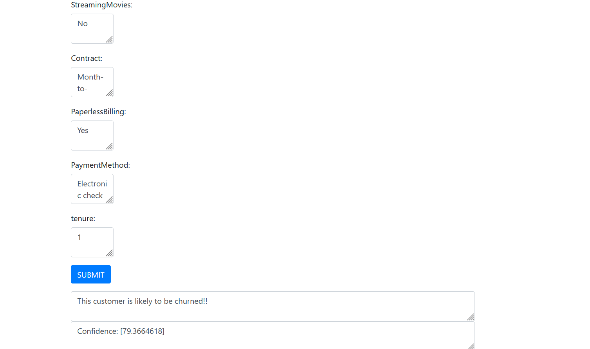

# Customer-Churn-Prediction-
Customer churn, also referred to as customer retention, turnover, or defection, denotes the departure of clients or customers from a business. Various industries, including telephone service, internet providers, pay TV companies, insurance firms, and alarm monitoring services, utilize customer attrition analysis and rates as crucial business metrics. This is because retaining existing customers is generally more cost-effective than acquiring new ones. Companies in these sectors often have dedicated customer service branches aimed at reclaiming departing clients, as the long-term value of recovered customers can surpass that of newly acquired ones.

There is typically a distinction between voluntary churn and involuntary churn. Voluntary churn results from a customer's decision to switch to another company or service provider, while involuntary churn is due to circumstances like a customer's relocation to a long-term care facility, death, or a distant location change. Analytical models often exclude involuntary reasons for churn, with a focus on voluntary churn. This is because voluntary churn is typically linked to factors within the company's control, such as billing interactions and after-sales support.

Predictive analytics leverages churn prediction models to assess the risk propensity of customers to churn. By generating a prioritized list of potential defectors, these models prove effective in directing customer retention marketing efforts towards the subset of the customer base most susceptible to churn.

